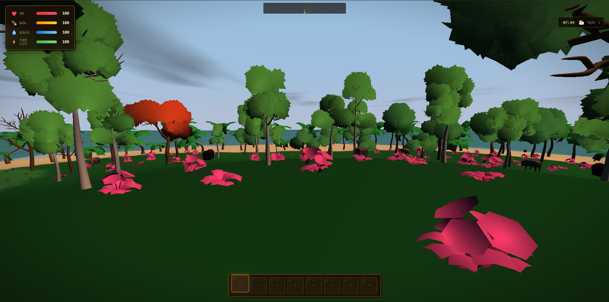
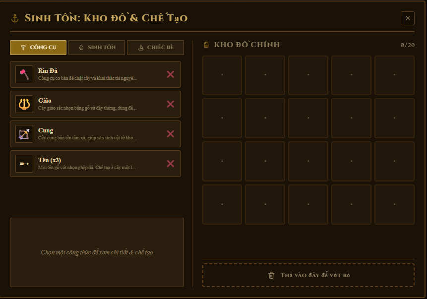
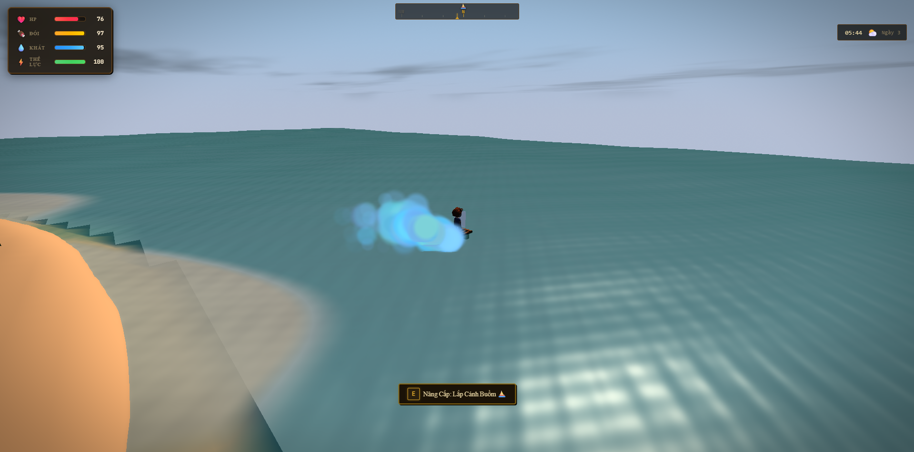

# Island Survival: Escape

Island Survival: Escape is a browser-based third-person survival game built with WebGL 2 and vanilla JavaScript. Explore a procedurally generated tropical island, manage your condition, gather resources, craft a raft, and escape before the island defeats you.



## Highlights

- Explore a seeded procedural island with beaches, forests, rocky areas, caverns, and a waterfall.
- Gather island materials and recover drifting debris from the sea.
- Craft tools, survival supplies, and the three parts required to build a raft.
- Manage health, hunger, thirst, and stamina through changing weather and the day-night cycle.
- Encounter passive and hostile wildlife, including crabs, seagulls, boars, and sharks.
- Save multiple worlds locally and continue an unfinished survival run.
- Unlock persistent achievements as you progress.



## Goal

Your objective is to escape the island. Collect materials, craft a Raft Frame, Barrel Floats, and a Paddle, then install them at the shoreline raft site and launch your escape.

## Requirements

- Node.js 20.19 or later, or Node.js 22.12 or later
- npm
- A modern desktop browser with WebGL 2 support

## Getting Started

Install dependencies and start the development server:

```bash
npm install
npm run dev
```

Vite will print a local URL. Open it in a browser to play the game. Source changes reload automatically during development.

## Production Build

Create and preview an optimized build:

```bash
npm run build
npm run preview
```

The production output is written to `dist/`. Game assets are copied so the built game can load its models and textures.

## Controls

| Input | Action |
| --- | --- |
| W, A, S, D | Move |
| Shift | Sprint while stamina is available |
| Left mouse button and drag | Orbit the camera |
| Mouse wheel | Zoom the camera |
| E | Interact, collect, or install raft parts |
| Tab | Toggle the inventory HUD |
| C | Open or close crafting |
| L | Lock the mouse cursor for direct camera look |
| Escape | Pause the game |
| F3 | Toggle the debug panel |
| K | Developer cheat: move to the beach and receive raft modules |



## Crafting Path

| Item | Materials | Purpose |
| --- | --- | --- |
| Stone Axe | 2 Wood, 2 Stone | A progression tool and tutorial milestone |
| Raft Frame | 10 Wood | The structural foundation of the raft |
| Barrel Floats | 3 Barrels, 1 Rope | Buoyancy for the raft |
| Paddle | 5 Wood, 2 Rope | The final raft component required to escape |

## Testing

Run the automated test suite with:

```bash
npm test
```

## Project Structure

```text
assets/       Game models, textures, audio resources, and manifests
docs/         Game design, technical documentation, and image placeholders
scripts/      Asset and build helper scripts
src/          Engine, rendering, gameplay, UI, and world-generation source code
tests/        Automated Node.js tests
index.html    Canvas container and UI markup
index.css     Game interface styles
```

## Documentation

- `docs/GDD.md` describes the game vision and core loop.
- `docs/GAME_RULES.md` covers gameplay rules and controls in detail.
- `docs/SYSTEMS.md` documents the main technical systems.
- `docs/FOLDER_STRUCTURE.md` provides a detailed source layout.

## Adding Screenshots

Add image files to `docs/images/` using the filenames referenced above, or update the paths in this README. Use landscape screenshots at a 16:9 ratio where possible so the project page remains consistent.
