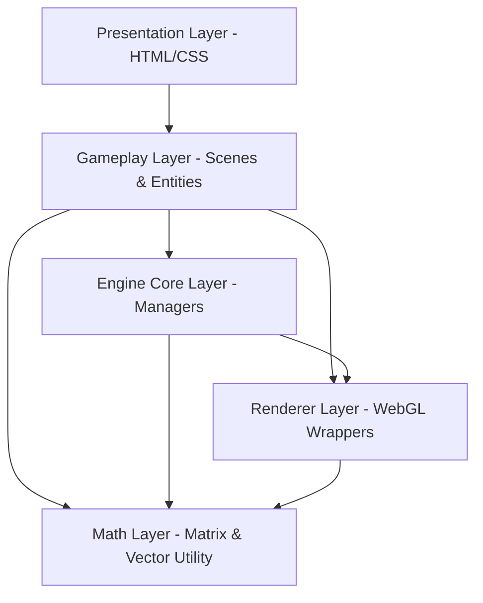

# Technical Design Document (TDD)

This document describes the software architecture, core modules, and engineering decisions behind the **Island Survival: Escape** game engine.

---

## 1. Design Philosophy & Constraints
*   **Pure WebGL 2.0:** No external 3D libraries (e.g., Three.js, Babylon.js, PlayCanvas) are used. All rendering logic, buffer handling, camera matrices, and lighting calculations are implemented from scratch using WebGL 2.0 APIs.
*   **Procedural Content Generation (PCG):** Island terrain meshes, wave displacement, and audio cues are synthesized at runtime to eliminate external asset file I/O overhead.
*   **Single Responsibility:** Each class manages a single scope. The gameplay layers are completely decoupled from WebGL API calls (graphics buffers are isolated in the `src/renderer/` folder).

---

## 2. System Architecture & Layering

The codebase is organized into five distinct architectural layers:

### A. Presentation Layer (UI Overlay)
*   **Components:** `index.html`, `index.css`.
*   **Responsibility:** Renders structural overlays (Main Menu, HUD, Crafting Panel, Debug Panel, Victory Screen). Utilizing CSS3 animations and flex layouts ensures optimal rendering performance without taxing WebGL draw call budgets.

### B. Gameplay Layer (Scenes & Entities)
*   **Components:** `src/scenes/`, `src/entities/`, `src/systems/`.
*   **Responsibility:**
    *   **Scenes (`LoadingScene`, `MainMenuScene`, `GameScene`):** Manages phase transitions and local scene lifecycles. All scenes inherit from the base `Scene.js` class.
    *   **Entities (`Player`, `Terrain`, `Water`, `WorldResource`, `DriftingDebris`, `RaftAssembly`):** Represents interactive elements in the virtual space. Tracks spatial transforms and computes local model matrices (`this.modelMatrix`). Inherits from `Entity.js`.
    *   **Systems (`Inventory`, `CraftingSystem`, `DebrisManager`, `ResourceManager`, `ParticleSystem`, `TutorialSystem`):** Performs game logic rules, collision updates, and inventory tracking.

### C. Engine Core Layer (Coordination & I/O)
*   **Components:** `src/core/`.
*   **Responsibility:**
    *   `Engine.js`: Initializes WebGL, creates the HTML5 canvas, and runs the scene state machine.
    *   `GameLoop.js`: Powers the main tick loop using `requestAnimationFrame`. Evaluates delta time between frames to guarantee smooth physics regardless of CPU stress.
    *   `InputManager.js`: Captures mouse clicks, cursor drifts, and keyboard presses.
    *   `AudioManager.js`: Synthesizes procedural waves and effects using the Web Audio API.

### D. Renderer Layer (WebGL Wrappers)
*   **Components:** `src/renderer/`, `src/shaders/`.
*   **Responsibility:**
    *   `Mesh.js`: Wraps WebGL Vertex Array Objects (VAO), Vertex Buffer Objects (VBO), Element Buffer Objects (EBO), and calls `gl.drawElements`.
    *   `ShaderProgram.js`: Compiles GLSL shaders, links programs, and binds uniforms.
    *   `Texture.js`: Instantiates WebGL Texture units and handles wrapping/filtering states.
    *   `Camera.js`: Computes View and Projection matrices.
    *   `Light.js`: Defines parameters for directional and ambient lighting.

### E. Math Layer (Utility Primitives)
*   **Components:** `src/math/`.
*   **Responsibility:** Provides standard 3D algebraic primitives (`Vec3` and `Mat4`) developed from scratch. Handles translation, rotation, scale transformations, and computes the orthographic, perspective projection, and view look-at matrices, eliminating external matrix library dependencies.

---

## 3. Notable Technical Implementations

### A. Gameplay and Renderer Separation
Entities do not directly call WebGL rendering commands. They store and calculate local positions, rotations, scales, and compile these transforms into a model matrix (`this.modelMatrix`). During the render pass, the active `GameScene` binds the pre-built `Mesh`, uploads the model matrix into the target `ShaderProgram` uniform, and requests a drawing pass. This allows sharing the same mesh geometries (e.g., box mesh, tree leaf mesh) across many entities, reducing memory overhead.

### B. Terrain Height Calculation (Bilinear Interpolation)
To keep the player character snapped to the sloped terrain at coordinate $(X, Z)$, the engine queries the height grid array. Since the player rarely stands exactly on grid vertices, the engine performs bilinear interpolation across the 4 surrounding terrain heights:
$$Y = \text{Bilinear}(X, Z, \text{GridHeights})$$
This results in smooth height transitions across slopes.

### C. Instanced Particles
Rendering hundreds of distinct particles (e.g., for wind, splashes, dust) individually would create high draw call overhead. To optimize this, the `ParticleSystem` uses instanced drawing (`gl.drawElementsInstanced`). Particle offsets, scales, and colors are packed into buffers and rendered in a single draw call.

### D. Web Audio API Synthesis
To eliminate static asset loading, the `AudioManager` builds an active audio node graph. For ambient sounds like ocean waves:
1.  A white noise generator outputs random audio samples to an `AudioBufferSourceNode`.
2.  The output is passed through a lowpass `BiquadFilterNode` to filter high frequencies.
3.  A slow LFO (Low-Frequency Oscillator) modulates a `GainNode` to fade the noise in and out periodically, mimicking waves hitting the shore.
4.  The final signal is routed to the destination speakers.
